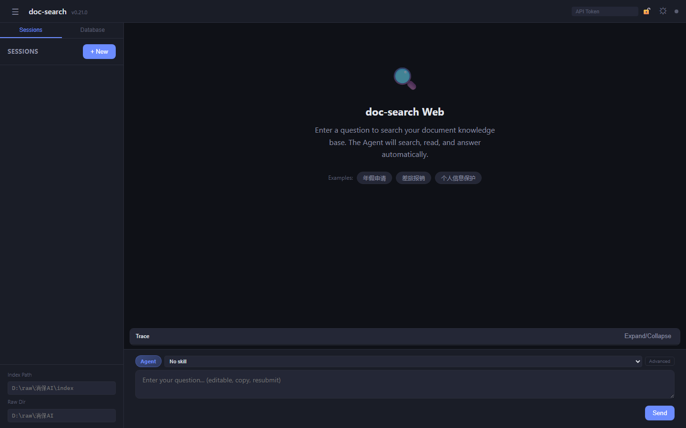

# doc-search-lite

<p align="right"><a href="README.zh.md">中文</a></p>

<p align="center">
  <strong>Your personal document deep-research assistant.</strong>
</p>

<div align="center">
  🔍 PDF/DOCX/XLSX/PPTX → Markdown → BM25 Index → LLM-powered Search &nbsp;|&nbsp; 🚫 No vector DB &nbsp;|&nbsp; 🖥️ CLI + Web + API + MCP
</div>

<br>

[](LICENSE)
[](pyproject.toml)
[](https://github.com/rickqi/doc-search-lite/actions/workflows/ci.yml)

---

## 💥 Introduction

**doc-search** started as a personal tool to solve a simple problem:
hundreds of insurance product clauses and medical diagnostic manuals
scattered across folders — impossible to search by keywords alone.

Over 50 releases in two months (v0.1 → v0.21, May–July 2026), it grew into a full-featured
**local document intelligence system** that converts any business document
to Markdown, builds a Tantivy BM25 index, and lets an LLM agent
search, read, cross-reference, and answer questions from your own knowledge base.
No documents ever leave your machine. No vector database required.

**doc-search-lite** is the open-source MIT core of that personal tool,
stripped of enterprise-specific features and internal configuration.
If you have a folder full of PDFs, DOCXs, or spreadsheets and need
to ask questions like *"What's our annual leave policy?"* or
*"Show me all clauses about data protection"* — this is for you.

## Why doc-search-lite?

This is the open-source core of [doc-search](https://github.com/rickqi/doc-search),
stripped of enterprise features and internal data. **No vector database, no local model inference.**

| Feature | doc-search (enterprise) | doc-search-lite (OSS) |
|---------|:----------------------:|:---------------------:|
| BM25 + Agent RAG search | ✅ | ✅ |
| Multi-format document conversion | ✅ | ✅ |
| Web UI + API + MCP | ✅ | ✅ |
| PII desensitization | ✅ | ✅ |
| Hybrid search (BM25+Grep RRF) | ✅ | ✅ |
| Multi-index search | ✅ | ✅ |
| Document structure awareness | ✅ | ✅ |
| CLI stats / diagnostics / budget | ✅ | ✅ |
| PDF enhancement (LA-3B) | ✅ | ❌ |
| Dify external knowledge API | ✅ | ❌ |
| Pi TUI | ✅ (deprecated) | ❌ |
| QA benchmark scripts | ✅ | ❌ |
| OpenCode Skill | ✅ | ❌ |
| License | PolyForm Strict | **MIT** |

### Comparison with DCI-Agent-Lite

[DCI-Agent-Lite](https://github.com/DCI-Agent/DCI-Agent-Lite) is an academic
research framework for the **Direct Corpus Interaction** paradigm —
an agent searches raw text corpora using terminal tools (`rg`, `find`, `sed`)
with no indexing. Both projects share the philosophy of **no vector databases**,
but target different use cases:

| Dimension | doc-search-lite | DCI-Agent-Lite |
|-----------|----------------|----------------|
| **Purpose** | Production document search system | Academic benchmark/evaluation |
| **Corpus** | Your own PDF/DOCX/XLSX/PPTX/HTML | Pre-formatted JSONL datasets (Wikipedia, BrowseComp) |
| **Indexing** | Tantivy BM25 (Rust) + jieba Bigram | **Zero index** — raw `rg`/`find` on text files |
| **Search modes** | BM25 / Grep / Hybrid (RRF) / Tag / Agent | Agent-only (bash tool loop) |
| **Document support** | 11 formats + OCR for images | Plain text / JSONL only |
| **Agent framework** | Custom SearchAgent (COMPILOT P0-P6) | Pi coding agent (bash + context mgmt) |
| **Interface** | CLI + Web UI + REST API + MCP 4 tools | Pi TUI only (`--terminal`) |
| **APIs** | FastAPI (21 routes), FastMCP (4 tools), SSE | None |
| **Observability** | Usage tracking, budget guard, 14-step diagnostics, search logging | None |
| **Security** | PII desensitization, API key auth | None |
| **Target audience** | Teams deploying document search | Researchers benchmarking agentic search |
| **License** | MIT | Apache 2.0 |
| **Paper** | — | [arXiv:2605.05242](https://arxiv.org/abs/2605.05242) |

## Quick Start

```bash
# 1. Install
git clone https://github.com/rickqi/doc-search-lite.git
cd doc-search-lite
python -m venv .venv
.venv\Scripts\pip install -e ".[dev]"

# 2. Copy env config
copy .env.example .env
# Edit .env, set GLM_API_KEY=your-key

# 3. Convert documents
.venv\Scripts\python -m src.cli batch-convert ./docs --raw-root ./raw

# 4. Build search index
.venv\Scripts\python -m src.cli build-index ./raw

# 5. Search
.venv\Scripts\python -m src.cli query "search query" -i ./raw/index --agent

# 6. Launch Web UI
.venv\Scripts\python -m src.api
```

> Requires **Python 3.10+** and a **ZhipuAI GLM API key** (also used for Rerank & OCR).
> DeepSeek is supported as an alternative LLM provider.

## Demo

<p align="center">
  
  <br>
  <em>Web UI (English) — Welcome page with quick actions. <a href="docs/screenshots/web-ui-zh.png">Chinese version →</a> | <a href="docs/screenshots/web-ui-session.png">Session view →</a> | <a href="docs/screenshots/web-ui-dark.png">Dark theme →</a></em>
</p>

## Features

- **Multi-format conversion**: PDF, DOCX, XLSX, PPTX, HTML, CSV, TXT, images (OCR), Outlook MSG, ZIP/7z/RAR archives
- **BM25 full-text search**: Tantivy (Rust) + jieba Chinese tokenization + Bigram fallback
- **Hybrid search**: BM25 + Grep parallel with RRF fusion, configurable profiles (legal/technical/faq/general)
- **Multi-index search**: Cross-database search with metadata routing
- **Agentic RAG**: LLM-driven tool loop (search/read/grep/rerank) with dynamic confidence, sufficiency checks, and convergence guards
- **COMPILOT optimizations** (v0.14+): ReAct reasoning, Draft verification loop, Tool feedback signals, Convergence nudging, Best-of-K, Confidence calibration
- **MCP Fast Pipeline** (v0.15+): Query rewriting + multi-query BM25 + speculative pre-read, ~12-18s vs 40-90s full tool loop
- **MCP Server**: FastMCP with 4 tools (`doc_search`/`doc_agent`/`doc_read`/`doc_analyze`), auto-index discovery
- **Dual LLM provider**: ZhipuAI GLM / DeepSeek, one-click switch
- **Tiered Model Routing**: Fast model for intermediate steps, power model for final answer
- **Web UI**: SSE streaming, session management, DB panel with token usage charts, file upload
- **PII desensitization**: Phone/ID/bank card masking before LLM calls, automatic restore
- **Directory watching**: Watchdog auto-indexing on file changes
- **Search modes**: BM25 / Grep / Hybrid / Tag / Agent — CLI + API + MCP
- **Skill system**: 6 built-in analysis skills + external SKILL.md loading
- **Stats & budget**: Usage tracking (millicents), budget guard, search logging, diagnostics (14-step timing)
- **5 complexity levels**: simple(2 rounds) / light(4) / medium(8) / complex(8 + decompose + verify + BOK)

## Architecture

<p align="center">
  
  <br>
  <em>System architecture — 3-column layout: DevOps/Storage (left), 7-layer pipeline (center), Security/Budget/Lifecycle (right).</em>
</p>
<tr>
<!-- LEFT SIDEBAR -->
<td style="width:150px;vertical-align:top;padding-right:8px">
<div style="background:#f3f4f6;border:1px solid #9ca3af;border-radius:8px;padding:10px;margin-bottom:8px">
<div style="font-weight:bold;text-align:center;font-size:12px;color:#1e293b;margin-bottom:6px">🖥️ DevOps</div>
<div style="background:#fff;border:1px solid #e5e7eb;border-radius:5px;padding:5px;margin:3px 0;text-align:center;font-size:10px;color:#374151">CLI (Click)<br><span style="font-size:9px;color:#6b7280">batch-convert / build-index / query / watch / stats</span></div>
<div style="background:#fff;border:1px solid #e5e7eb;border-radius:5px;padding:5px;margin:3px 0;text-align:center;font-size:10px;color:#374151">pip install<br><span style="font-size:9px;color:#6b7280">Python 3.10+</span></div>
<div style="background:#fff;border:1px solid #e5e7eb;border-radius:5px;padding:5px;margin:3px 0;text-align:center;font-size:10px;color:#374151">.env Config<br><span style="font-size:9px;color:#6b7280">GLM/DeepSeek Keys</span></div>
</div>
<div style="background:#f3f4f6;border:1px solid #9ca3af;border-radius:8px;padding:10px;margin-bottom:8px">
<div style="font-weight:bold;text-align:center;font-size:12px;color:#1e293b;margin-bottom:6px">📊 Observability</div>
<div style="background:#dbeafe;border:1px solid #3b82f6;border-radius:5px;padding:5px;margin:3px 0;text-align:center;font-size:10px;color:#1e40af;font-weight:600">UsageTracker<br><span style="font-size:9px;color:#6b7280;font-weight:400">OCR/LLM/Rerank</span></div>
<div style="background:#dbeafe;border:1px solid #3b82f6;border-radius:5px;padding:5px;margin:3px 0;text-align:center;font-size:10px;color:#1e40af;font-weight:600">BudgetGuard<br><span style="font-size:9px;color:#6b7280;font-weight:400">Monthly Caps</span></div>
<div style="background:#dbeafe;border:1px solid #3b82f6;border-radius:5px;padding:5px;margin:3px 0;text-align:center;font-size:10px;color:#1e40af;font-weight:600">Diagnostics<br><span style="font-size:9px;color:#6b7280;font-weight:400">14-Step Timing</span></div>
<div style="background:#dbeafe;border:1px solid #3b82f6;border-radius:5px;padding:5px;margin:3px 0;text-align:center;font-size:10px;color:#1e40af;font-weight:600">SearchLogger<br><span style="font-size:9px;color:#6b7280;font-weight:400">Async Logging</span></div>
<div style="background:#fff;border:1px solid #e5e7eb;border-radius:5px;padding:5px;margin:3px 0;text-align:center;font-size:10px;color:#374151">AgentMemory<br><span style="font-size:9px;color:#6b7280">Q&A Recall</span></div>
</div>
<div style="background:#f3f4f6;border:1px solid #9ca3af;border-radius:8px;padding:10px;margin-bottom:8px">
<div style="font-weight:bold;text-align:center;font-size:12px;color:#1e293b;margin-bottom:6px">📦 Storage</div>
<div style="background:#fff;border:1px solid #e5e7eb;border-radius:5px;padding:5px;margin:3px 0;text-align:center;font-size:10px;color:#374151">Tantivy Index<br><span style="font-size:9px;color:#6b7280">BM25 Schema v2</span></div>
<div style="background:#fff;border:1px solid #e5e7eb;border-radius:5px;padding:5px;margin:3px 0;text-align:center;font-size:10px;color:#374151">ConvertDB<br><span style="font-size:9px;color:#6b7280">SQLite Schema v2.1</span></div>
<div style="background:#fff;border:1px solid #e5e7eb;border-radius:5px;padding:5px;margin:3px 0;text-align:center;font-size:10px;color:#374151">Markdown Files<br><span style="font-size:9px;color:#6b7280">.md + .md.json</span></div>
</div>
</td>

<!-- MAIN CONTENT -->
<td style="vertical-align:top;padding:0 8px">
<div style="background:#dbeafe;border:2px solid #3b82f6;border-radius:8px;padding:10px;margin-bottom:8px">
<div style="font-weight:bold;text-align:center;font-size:13px;color:#1e40af;margin-bottom:8px">🎯 User Interface Layer</div>
<table style="width:100%;border-collapse:collapse"><tr>
<td style="width:25%;background:#fff;border:2px solid #2563eb;border-radius:6px;padding:8px;text-align:center;font-weight:600;color:#1e293b">CLI (Click)<br><span style="font-size:10px;font-weight:400;color:#475569">batch-convert / query</span></td>
<td style="width:25%;background:#fff;border:2px solid #2563eb;border-radius:6px;padding:8px;text-align:center;font-weight:600;color:#1e293b">Web UI<br><span style="font-size:10px;font-weight:400;color:#475569">FastAPI + vanilla CSS/JS + SSE</span></td>
<td style="width:25%;background:#fff;border:1px solid #cbd5e1;border-radius:6px;padding:8px;text-align:center;font-weight:600;color:#1e293b">MCP Server<br><span style="font-size:10px;font-weight:400;color:#475569">FastMCP — 4 tools</span></td>
<td style="width:25%;background:#fff;border:1px solid #cbd5e1;border-radius:6px;padding:8px;text-align:center;font-weight:600;color:#1e293b">REST API<br><span style="font-size:10px;font-weight:400;color:#475569">21+ endpoints</span></td>
</tr></table></div>

<div style="background:#fef3c7;border:2px solid #eab308;border-radius:8px;padding:10px;margin-bottom:8px">
<div style="font-weight:bold;text-align:center;font-size:13px;color:#854d0e;margin-bottom:8px">⚙️ API & Gateway Layer</div>
<table style="width:100%;border-collapse:collapse"><tr>
<td style="width:33%;background:#fff;border:1px solid #cbd5e1;border-radius:6px;padding:8px;text-align:center;font-weight:600;color:#1e293b">Auth Middleware<br><span style="font-size:10px;font-weight:400;color:#475569">Bearer / X-API-Key</span></td>
<td style="width:33%;background:#fff;border:1px solid #cbd5e1;border-radius:6px;padding:8px;text-align:center;font-weight:600;color:#1e293b">Session Manager<br><span style="font-size:10px;font-weight:400;color:#475569">SSE + SQLite persistence</span></td>
<td style="width:33%;background:#fff;border:1px solid #cbd5e1;border-radius:6px;padding:8px;text-align:center;font-weight:600;color:#1e293b">Intent Classifier<br><span style="font-size:10px;font-weight:400;color:#475569">3-mode routing</span></td>
</tr></table></div>

<div style="background:#d1fae5;border:2px solid #10b981;border-radius:8px;padding:10px;margin-bottom:8px">
<div style="font-weight:bold;text-align:center;font-size:13px;color:#065f46;margin-bottom:8px">🧠 Agent Intelligence Layer</div>
<table style="width:100%;border-collapse:collapse"><tr>
<td style="width:33%;background:#fff;border:2px solid #2563eb;border-radius:6px;padding:8px;text-align:center;font-weight:600;color:#1e293b">SearchAgent<br><span style="font-size:10px;font-weight:400;color:#475569">tool_loop (8 rounds) / pipeline</span></td>
<td style="width:33%;background:#fff;border:1px solid #cbd5e1;border-radius:6px;padding:8px;text-align:center;font-weight:600;color:#1e293b">LLMClient<br><span style="font-size:10px;font-weight:400;color:#475569">LiteLLM — GLM / DeepSeek</span></td>
<td style="width:33%;background:#fff;border:1px solid #cbd5e1;border-radius:6px;padding:8px;text-align:center;font-weight:600;color:#1e293b">6 Agent Tools<br><span style="font-size:10px;font-weight:400;color:#475569">Search / Grep / Read / Rerank / Summarize / Bash</span></td>
</tr></table>
<div style="margin-top:6px"><table style="width:100%;border-collapse:collapse"><tr>
<td style="width:25%;background:#f8fafc;border:1px solid #cbd5e1;border-radius:4px;padding:4px;text-align:center;font-size:10px;color:#475569">P0 ReAct<br><span style="font-size:9px;color:#6b7280">Thought→Action</span></td>
<td style="width:25%;background:#f8fafc;border:1px solid #cbd5e1;border-radius:4px;padding:4px;text-align:center;font-size:10px;color:#475569">P1 Draft Verify<br><span style="font-size:9px;color:#6b7280">Closed-loop</span></td>
<td style="width:25%;background:#f8fafc;border:1px solid #cbd5e1;border-radius:4px;padding:4px;text-align:center;font-size:10px;color:#475569">P2 Feedback<br><span style="font-size:9px;color:#6b7280">Tool signals</span></td>
<td style="width:25%;background:#f8fafc;border:1px solid #cbd5e1;border-radius:4px;padding:4px;text-align:center;font-size:10px;color:#475569">P3-P6<br><span style="font-size:9px;color:#6b7280">Nudge/BOK/Confidence</span></td>
</tr></table></div></div>

<div style="background:#ede9fe;border:2px solid #8b5cf6;border-radius:8px;padding:10px;margin-bottom:8px">
<div style="font-weight:bold;text-align:center;font-size:13px;color:#5b21b6;margin-bottom:8px">🔍 Search Pipeline Layer</div>
<table style="width:100%;border-collapse:collapse"><tr>
<td style="width:25%;background:#fff;border:1px solid #cbd5e1;border-radius:6px;padding:8px;text-align:center;font-weight:600;color:#1e293b">BM25<br><span style="font-size:10px;font-weight:400;color:#475569">Tantivy + jieba + Bigram</span></td>
<td style="width:25%;background:#fff;border:1px solid #cbd5e1;border-radius:6px;padding:8px;text-align:center;font-weight:600;color:#1e293b">Hybrid<br><span style="font-size:10px;font-weight:400;color:#475569">BM25+Grep RRF K=60</span></td>
<td style="width:25%;background:#fff;border:1px solid #cbd5e1;border-radius:6px;padding:8px;text-align:center;font-weight:600;color:#1e293b">Multi-Index<br><span style="font-size:10px;font-weight:400;color:#475569">Fan-out + namespace</span></td>
<td style="width:25%;background:#fff;border:1px solid #cbd5e1;border-radius:6px;padding:8px;text-align:center;font-weight:600;color:#1e293b">Reranker<br><span style="font-size:10px;font-weight:400;color:#475569">ZhipuAI / local bge</span></td>
</tr></table></div>

<div style="background:#e0e7ff;border:2px solid #6366f1;border-radius:8px;padding:10px;margin-bottom:8px">
<div style="font-weight:bold;text-align:center;font-size:13px;color:#4338ca;margin-bottom:8px">📄 Conversion Pipeline Layer</div>
<table style="width:100%;border-collapse:collapse"><tr>
<td style="width:20%;background:#f8fafc;border:1px solid #cbd5e1;border-radius:4px;padding:5px;text-align:center;font-size:10px;color:#475569">PDF<br><span style="font-size:9px;color:#6b7280">pdfplumber+pypdf+OCR</span></td>
<td style="width:20%;background:#f8fafc;border:1px solid #cbd5e1;border-radius:4px;padding:5px;text-align:center;font-size:10px;color:#475569">Office<br><span style="font-size:9px;color:#6b7280">MarkItDown</span></td>
<td style="width:20%;background:#f8fafc;border:1px solid #cbd5e1;border-radius:4px;padding:5px;text-align:center;font-size:10px;color:#475569">HTML/CSV<br><span style="font-size:9px;color:#6b7280">table alignment fix</span></td>
<td style="width:20%;background:#f8fafc;border:1px solid #cbd5e1;border-radius:4px;padding:5px;text-align:center;font-size:10px;color:#475569">Images<br><span style="font-size:9px;color:#6b7280">OCR 4 engines</span></td>
<td style="width:20%;background:#f8fafc;border:1px solid #cbd5e1;border-radius:4px;padding:5px;text-align:center;font-size:10px;color:#475569">Archives<br><span style="font-size:9px;color:#6b7280">ZIP/7z/RAR/tar</span></td>
</tr></table></div>

<div style="background:#fce7f3;border:2px solid #ec4899;border-radius:8px;padding:10px;margin-bottom:8px">
<div style="font-weight:bold;text-align:center;font-size:13px;color:#9d174d;margin-bottom:8px">🗄️ Data & Persistence Layer</div>
<table style="width:100%;border-collapse:collapse"><tr>
<td style="width:33%;background:#fff;border:1px solid #cbd5e1;border-radius:6px;padding:8px;text-align:center;font-weight:600;color:#1e293b">Tantivy Index<br><span style="font-size:10px;font-weight:400;color:#475569">BM25 — title boost + highlights</span></td>
<td style="width:33%;background:#fff;border:1px solid #cbd5e1;border-radius:6px;padding:8px;text-align:center;font-weight:600;color:#1e293b">ConvertDB (SQLite)<br><span style="font-size:10px;font-weight:400;color:#475569">Schema v2.1</span></td>
<td style="width:33%;background:#fff;border:1px solid #cbd5e1;border-radius:6px;padding:8px;text-align:center;font-weight:600;color:#1e293b">File Store<br><span style="font-size:10px;font-weight:400;color:#475569">.md + .md.json</span></td>
</tr></table></div>

<div style="background:#f8fafc;border:2px dashed #94a3b8;border-radius:8px;padding:10px;margin-bottom:8px">
<div style="font-weight:bold;text-align:center;font-size:13px;color:#64748b;margin-bottom:8px">☁️ External Services</div>
<table style="width:100%;border-collapse:collapse"><tr>
<td style="width:25%;background:#f8fafc;border:1px solid #cbd5e1;border-radius:4px;padding:5px;text-align:center;font-size:10px;color:#475569">ZhipuAI GLM<br><span style="font-size:9px;color:#6b7280">LLM + Rerank + OCR</span></td>
<td style="width:25%;background:#f8fafc;border:1px solid #cbd5e1;border-radius:4px;padding:5px;text-align:center;font-size:10px;color:#475569">DeepSeek<br><span style="font-size:9px;color:#6b7280">Alternative LLM</span></td>
<td style="width:25%;background:#f8fafc;border:1px solid #cbd5e1;border-radius:4px;padding:5px;text-align:center;font-size:10px;color:#475569">PaddleOCR<br><span style="font-size:9px;color:#6b7280">Local GPU OCR</span></td>
<td style="width:25%;background:#f8fafc;border:1px solid #cbd5e1;border-radius:4px;padding:5px;text-align:center;font-size:10px;color:#475569">LiteLLM<br><span style="font-size:9px;color:#6b7280">200+ provider proxy</span></td>
</tr></table></div>
</td>

<!-- RIGHT SIDEBAR -->
<td style="width:150px;vertical-align:top;padding-left:8px">
<div style="background:#f3f4f6;border:1px solid #9ca3af;border-radius:8px;padding:10px;margin-bottom:8px">
<div style="font-weight:bold;text-align:center;font-size:12px;color:#1e293b;margin-bottom:6px">🔒 Security</div>
<div style="background:#fff;border:1px solid #e5e7eb;border-radius:5px;padding:5px;margin:3px 0;text-align:center;font-size:10px;color:#374151">PII Desensitizer<br><span style="font-size:9px;color:#6b7280">Phone/ID/Bank card masking</span></div>
<div style="background:#fff;border:1px solid #e5e7eb;border-radius:5px;padding:5px;margin:3px 0;text-align:center;font-size:10px;color:#374151">API Key Auth<br><span style="font-size:9px;color:#6b7280">Bearer / X-API-Key</span></div>
<div style="background:#fff;border:1px solid #e5e7eb;border-radius:5px;padding:5px;margin:3px 0;text-align:center;font-size:10px;color:#374151">Auth Audit Log<br><span style="font-size:9px;color:#6b7280">token/endpoint/IP/status</span></div>
<div style="background:#fff;border:1px solid #e5e7eb;border-radius:5px;padding:5px;margin:3px 0;text-align:center;font-size:10px;color:#374151">Fail-safe Design<br><span style="font-size:9px;color:#6b7280">Never block on error</span></div>
</div>
<div style="background:#f3f4f6;border:1px solid #9ca3af;border-radius:8px;padding:10px;margin-bottom:8px">
<div style="font-weight:bold;text-align:center;font-size:12px;color:#1e293b;margin-bottom:6px">📈 Cost & Budget</div>
<div style="background:#dbeafe;border:1px solid #3b82f6;border-radius:5px;padding:5px;margin:3px 0;text-align:center;font-size:10px;color:#1e40af;font-weight:600">Tiered Routing<br><span style="font-size:9px;color:#6b7280;font-weight:400">Flash $0.005/query</span></div>
<div style="background:#dbeafe;border:1px solid #3b82f6;border-radius:5px;padding:5px;margin:3px 0;text-align:center;font-size:10px;color:#1e40af;font-weight:600">Token Tracking<br><span style="font-size:9px;color:#6b7280;font-weight:400">Millicents precision</span></div>
<div style="background:#dbeafe;border:1px solid #3b82f6;border-radius:5px;padding:5px;margin:3px 0;text-align:center;font-size:10px;color:#1e40af;font-weight:600">Budget Limits<br><span style="font-size:9px;color:#6b7280;font-weight:400">Monthly/total caps</span></div>
<div style="background:#dbeafe;border:1px solid #3b82f6;border-radius:5px;padding:5px;margin:3px 0;text-align:center;font-size:10px;color:#1e40af;font-weight:600">AlertManager<br><span style="font-size:9px;color:#6b7280;font-weight:400">Webhook + dedup 5min</span></div>
</div>
<div style="background:#f3f4f6;border:1px solid #9ca3af;border-radius:8px;padding:10px;margin-bottom:8px">
<div style="font-weight:bold;text-align:center;font-size:12px;color:#1e293b;margin-bottom:6px">🔄 Lifecycle</div>
<div style="background:#fff;border:1px solid #e5e7eb;border-radius:5px;padding:5px;margin:3px 0;text-align:center;font-size:10px;color:#374151">File Status<br><span style="font-size:9px;color:#6b7280">pending→converting→success</span></div>
<div style="background:#fff;border:1px solid #e5e7eb;border-radius:5px;padding:5px;margin:3px 0;text-align:center;font-size:10px;color:#374151">Batch Resume<br><span style="font-size:9px;color:#6b7280">Interrupted→restart</span></div>
<div style="background:#fff;border:1px solid #e5e7eb;border-radius:5px;padding:5px;margin:3px 0;text-align:center;font-size:10px;color:#374151">Incremental<br><span style="font-size:9px;color:#6b7280">Hash + mtime detect</span></div>
<div style="background:#fff;border:1px solid #e5e7eb;border-radius:5px;padding:5px;margin:3px 0;text-align:center;font-size:10px;color:#374151">Watchdog<br><span style="font-size:9px;color:#6b7280">Auto re-index</span></div>
</div>
</td>
</tr>
</table>
</div>
<p align="center">
  
  <br>
  <em>System architecture — 3-column layout: DevOps/Storage (left), 7-layer pipeline (center), Security/Budget/Lifecycle (right).</em>
</p>

### Pipeline

```
Documents (PDF/DOCX/XLSX/PPTX/HTML/CSV/TXT/Images)
    │
    ConverterCoordinator → Markdown → .md + .md.json (headings, tags)
    │
    Tantivy Index (jieba + Bigram + title boost)
    │
    ┌── BM25 keyword search ────┐
    ├── Grep regex search        ├── 4 modes
    ├── Hybrid RRF fusion        │
    └── Tag-based recall ────────┘
    │
    ┌── Agent tool_loop (8 rounds) ──┐
    │  search → read → search →     │  COMPILOT P0-P6
    │  read → rerank → synthesize   │
    └────────────────────────────────┘
    │
    LLM (GLM / DeepSeek) → Answer with citations
```

### Local Database (convert.db)

Each raw directory gets a `convert.db` (SQLite, WAL mode) that tracks every file's lifecycle end-to-end:

```
convert.db (per raw/ directory)
├── Schema: "2.1" (auto-migrated from 1.1 → 2.0 → 2.1)
├── WAL mode, foreign keys enabled
│
├── directories/     # Directory tree mirroring source structure
├── files/           # Per-file state machine
│   ├── status: pending → converting → success | failed | skipped
│   ├── source_hash, mtime for incremental detection
│   ├── converter, convert_time, ocr_tokens, pipeline_version
│   └── metadata_json, last_error
├── batches/         # Conversion batch history (resume support)
├── skipped/         # Skip reasons (unsupported format, password-protected)
├── config/          # Schema version, pipeline metadata
│
├── token_usage/     # OCR/LLM token consumption (per-file, per-model)
├── pricing/         # Model price mapping (millicents per token)
├── budget/          # Monthly/total budget limits and spending
│
├── search_feedback/ # 👍/👎 user relevance feedback
├── auth_log/        # API authentication audit trail
│
├── query_diagnostics/  # 14-step query performance timing
└── llm_call_log/       # Per-call LLM latency, tokens, retry count
```

## Commands

### Document Conversion

```bash
python -m src.cli batch-convert ./docs --raw-root ./raw
python -m src.cli batch-convert ./docs --raw-root ./raw --mode incremental
python -m src.cli batch-convert ./docs --raw-root ./raw --parallel 4
python -m src.cli batch-convert ./docs --raw-root ./raw --force
python -m src.cli batch-convert ./docs --raw-root ./raw --no-ocr
```

### Index Management

```bash
python -m src.cli build-index ./raw
python -m src.cli watch ./raw --debounce 1.0
python -m src.cli build-index ./raw --chunk-mode
```

### Search

```bash
python -m src.cli query "annual leave policy" -i ./raw/index -l 5
python -m src.cli query "confidentiality" -i ./raw
python -m src.cli query "data protection" -i ./raw/index --search-mode hybrid
python -m src.cli query "报销" -i ./raw/index --search-mode tag
python -m src.cli query "keyword" -i ./raw/index --export json -o results.json
```

### Agent Search

```bash
python -m src.cli query "How do I apply for annual leave?" -i ./raw/index --agent
python -m src.cli query "What's the travel reimbursement policy?" -i ./raw/index --agent --rerank
python -m src.cli query "出差标准" -i ./raw/index --agent --skill summarize
python -m src.cli query "" -i ./raw/index --interactive
```

### Web UI

```bash
python -m src.api
python -m src.api --host 0.0.0.0 --port 8080
```

### MCP Server

```bash
pip install -e ".[mcp]"
python -m src.mcp_server
```

**MCP Tools**:

| Tool | Description |
|------|-------------|
| `doc_search` | BM25 / Hybrid / Grep keyword search |
| `doc_agent` | Agentic RAG with LLM answer generation |
| `doc_read` | Read full document content by doc_id or source_path |
| `doc_analyze` | Deep document analysis (compare/extract/summarize/table) |

### Stats & Diagnostics

```bash
python -m src.cli stats summary --days 7
python -m src.cli stats daily --days 30
python -m src.cli stats export --format html -o report.html
python -m src.cli stats budget list
python -m src.cli stats diagnostics --days 7
python -m src.cli stats slow-queries --threshold 30000
```

### Directory Migration

```bash
python -m src.cli diff-migrate /path/to/base /path/to/compare
python -m src.cli diff-migrate /path/to/base /path/to/compare --export-new /path/to/export
```

## Supported Formats

| Format | Extension | Converter |
|--------|-----------|-----------|
| PDF | `.pdf` | pdfplumber + pypdf (scanned PDF auto OCR) |
| Word | `.docx` | MarkItDown |
| Excel | `.xlsx`, `.xls` | MarkItDown (>5MB auto LibreOffice → CSV) |
| PowerPoint | `.pptx` | MarkItDown |
| HTML | `.html`, `.htm` | MarkItDown + table alignment fix |
| CSV | `.csv` | pandas + auto encoding detection |
| Text | `.txt` | Auto encoding (utf-8/gbk/gb2312) |
| Markdown | `.md` | Pass-through |
| Images | `.png`, `.jpg`, `.jpeg`, `.bmp`, `.webp` | ZhipuAI / PaddleOCR / PP-StructureV3 |
| Email | `.msg` | olefile (Outlook OLE2) |
| Archives | `.zip`, `.7z`, `.rar`, `.tar`, `.gz` | Extract → convert → clean |

> `.doc` format requires pre-conversion to `.docx` via LibreOffice.

## Configuration

Copy `.env.example` to `.env` and configure:

```ini
GLM_API_KEY=your-glm-api-key
GLM_BASE_URL=https://open.bigmodel.cn/api/paas/v4
LLM_PROVIDER=glm
LLM_MODEL=glm-4
DEEPSEEK_API_KEY=your-deepseek-api-key
LLM_TIERED_ROUTING=false
WEB_API_KEY=your-secret-key
OCR_ENGINE=zhipu
```

## Tech Stack

| Layer | Technology |
|-------|-----------|
| Search engine | Tantivy (Rust, Python bindings) |
| Chinese tokenization | jieba + Bigram fallback |
| LLM integration | LiteLLM (GLM / DeepSeek / 200+ providers) |
| Rerank | ZhipuAI cloud API (default) or local bge-reranker-v2-m3 |
| OCR | ZhipuAI / PaddleOCR / PaddleOCR HTTP / PP-StructureV3 |
| Document conversion | MarkItDown 0.1.x, pdfplumber, pypdf, olefile, pandas |
| Web framework | FastAPI + SSE + vanilla CSS/JS + Chart.js |
| CLI framework | Click + Rich |
| Storage | SQLite (WAL mode), Tantivy index, filesystem |
| File watching | watchdog |

## Key Design Decisions

- **No vector database**: BM25 + jieba provides better keyword precision for legal/insurance/regulatory documents
- **Whole-document indexing**: Preserves full context vs chunk-splitting that loses document structure
- **Result-based error handling**: `ConvertResult(success, errors)` and `ToolResult.ok()/.fail()` throughout
- **Optional traceability**: `UsageTracker=None` everywhere — zero cost when not configured
- **Fail-safe desensitization**: PII masking failures fall back to original text, never block LLM calls
- **Tiered routing**: Fast cheap model for intermediate steps, expensive model only for final answer

## Development

```bash
.venv\Scripts\python.exe -m pytest tests/ -q --tb=short
.venv\Scripts\python.exe -m pytest tests/ --cov
.venv\Scripts\ruff check src/ tests/
.venv\Scripts\ruff format src/ tests/
```

## License

MIT License — see [LICENSE](LICENSE).
