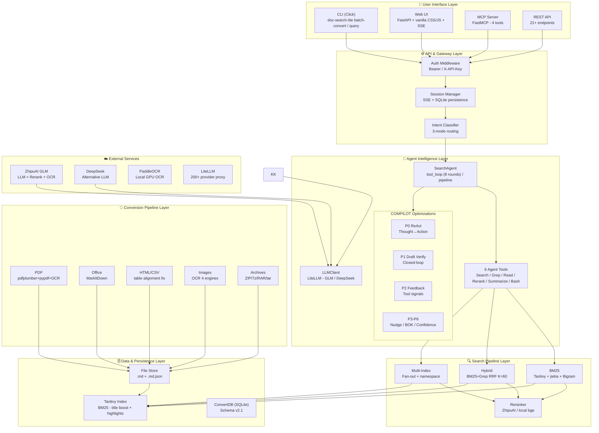

# doc-search-lite

<p align="center">
  <strong>Your personal document deep-research assistant.</strong>
</p>

<div align="center">
  🔍 PDF/DOCX/XLSX/PPTX → Markdown → BM25 Index → LLM-powered Search &nbsp;|&nbsp; 🚫 No vector DB &nbsp;|&nbsp; 🖥️ CLI + Web + API + MCP
</div>

<br>

[](LICENSE)
[](pyproject.toml)
[](https://github.com/rickqi/doc-search-lite/actions/workflows/ci.yml)

---

## 💥 Introduction

**doc-search** started as a personal tool to solve a simple problem:
hundreds of insurance product clauses and medical diagnostic manuals
scattered across folders — impossible to search by keywords alone.

Over 50 releases in two months (v0.1 → v0.21, May–July 2026), it grew into a full-featured
**local document intelligence system** that converts any business document
to Markdown, builds a Tantivy BM25 index, and lets an LLM agent
search, read, cross-reference, and answer questions from your own knowledge base.
No documents ever leave your machine. No vector database required.

**doc-search-lite** is the open-source MIT core of that personal tool,
stripped of enterprise-specific features and internal configuration.
If you have a folder full of PDFs, DOCXs, or spreadsheets and need
to ask questions like *"What's our annual leave policy?"* or
*"Show me all clauses about data protection"* — this is for you.

## Why doc-search-lite?

This is the open-source core of [doc-search](https://github.com/rickqi/doc-search),
stripped of enterprise features and internal data. **No vector database, no local model inference.**

| Feature | doc-search (enterprise) | doc-search-lite (OSS) |
|---------|:----------------------:|:---------------------:|
| BM25 + Agent RAG search | ✅ | ✅ |
| Multi-format document conversion | ✅ | ✅ |
| Web UI + API + MCP | ✅ | ✅ |
| PII desensitization | ✅ | ✅ |
| Hybrid search (BM25+Grep RRF) | ✅ | ✅ |
| Multi-index search | ✅ | ✅ |
| Document structure awareness | ✅ | ✅ |
| CLI stats / diagnostics / budget | ✅ | ✅ |
| PDF enhancement (LA-3B) | ✅ | ❌ |
| Dify external knowledge API | ✅ | ❌ |
| Pi TUI | ✅ (deprecated) | ❌ |
| QA benchmark scripts | ✅ | ❌ |
| OpenCode Skill | ✅ | ❌ |
| License | PolyForm Strict | **MIT** |

### Comparison with DCI-Agent-Lite

[DCI-Agent-Lite](https://github.com/DCI-Agent/DCI-Agent-Lite) is an academic
research framework for the **Direct Corpus Interaction** paradigm —
an agent searches raw text corpora using terminal tools (`rg`, `find`, `sed`)
with no indexing. Both projects share the philosophy of **no vector databases**,
but target different use cases:

| Dimension | doc-search-lite | DCI-Agent-Lite |
|-----------|----------------|----------------|
| **Purpose** | Production document search system | Academic benchmark/evaluation |
| **Corpus** | Your own PDF/DOCX/XLSX/PPTX/HTML | Pre-formatted JSONL datasets (Wikipedia, BrowseComp) |
| **Indexing** | Tantivy BM25 (Rust) + jieba Bigram | **Zero index** — raw `rg`/`find` on text files |
| **Search modes** | BM25 / Grep / Hybrid (RRF) / Tag / Agent | Agent-only (bash tool loop) |
| **Document support** | 11 formats + OCR for images | Plain text / JSONL only |
| **Agent framework** | Custom SearchAgent (COMPILOT P0-P6) | Pi coding agent (bash + context mgmt) |
| **Interface** | CLI + Web UI + REST API + MCP 4 tools | Pi TUI only (`--terminal`) |
| **APIs** | FastAPI (21 routes), FastMCP (4 tools), SSE | None |
| **Observability** | Usage tracking, budget guard, 14-step diagnostics, search logging | None |
| **Security** | PII desensitization, API key auth | None |
| **Target audience** | Teams deploying document search | Researchers benchmarking agentic search |
| **License** | MIT | Apache 2.0 |
| **Paper** | — | [arXiv:2605.05242](https://arxiv.org/abs/2605.05242) |

## Quick Start

```bash
# 1. Install
git clone https://github.com/rickqi/doc-search-lite.git
cd doc-search-lite
python -m venv .venv
.venv\Scripts\pip install -e ".[dev]"

# 2. Copy env config
copy .env.example .env
# Edit .env, set GLM_API_KEY=your-key

# 3. Convert documents
.venv\Scripts\python -m src.cli batch-convert ./docs --raw-root ./raw

# 4. Build search index
.venv\Scripts\python -m src.cli build-index ./raw

# 5. Search
.venv\Scripts\python -m src.cli query "search query" -i ./raw/index --agent

# 6. Launch Web UI
.venv\Scripts\python -m src.api
```

> Requires **Python 3.10+** and a **ZhipuAI GLM API key** (also used for Rerank & OCR).
> DeepSeek is supported as an alternative LLM provider.

## Demo

<p align="center">
  
  <br>
  <em>Web UI — Agent search with SSE streaming, tool call trace, and source citations. <a href="docs/screenshots/">More screenshots →</a></em>
</p>

<!--
  TODO: Add screenshots:
  1. docs/screenshots/web-ui.png    — Web UI with a completed Agent search
  2. docs/screenshots/cli-demo.gif   — Terminal recording of CLI workflow
  3. docs/screenshots/db-panel.png  — DB stats and token usage chart
  4. docs/screenshots/mcp.png       — MCP tools in OpenCode/Claude
-->

## Features

- **Multi-format conversion**: PDF, DOCX, XLSX, PPTX, HTML, CSV, TXT, images (OCR), Outlook MSG, ZIP/7z/RAR archives
- **BM25 full-text search**: Tantivy (Rust) + jieba Chinese tokenization + Bigram fallback
- **Hybrid search**: BM25 + Grep parallel with RRF fusion, configurable profiles (legal/technical/faq/general)
- **Multi-index search**: Cross-database search with metadata routing
- **Agentic RAG**: LLM-driven tool loop (search/read/grep/rerank) with dynamic confidence, sufficiency checks, and convergence guards
- **COMPILOT optimizations** (v0.14+): ReAct reasoning, Draft verification loop, Tool feedback signals, Convergence nudging, Best-of-K, Confidence calibration
- **MCP Fast Pipeline** (v0.15+): Query rewriting + multi-query BM25 + speculative pre-read, ~12-18s vs 40-90s full tool loop
- **MCP Server**: FastMCP with 4 tools (`doc_search`/`doc_agent`/`doc_read`/`doc_analyze`), auto-index discovery
- **Dual LLM provider**: ZhipuAI GLM / DeepSeek, one-click switch
- **Tiered Model Routing**: Fast model for intermediate steps, power model for final answer
- **Web UI**: SSE streaming, session management, DB panel with token usage charts, file upload
- **PII desensitization**: Phone/ID/bank card masking before LLM calls, automatic restore
- **Directory watching**: Watchdog auto-indexing on file changes
- **Search modes**: BM25 / Grep / Hybrid / Tag / Agent — CLI + API + MCP
- **Skill system**: 6 built-in analysis skills + external SKILL.md loading
- **Stats & budget**: Usage tracking (millicents), budget guard, search logging, diagnostics (14-step timing)
- **5 complexity levels**: simple(2 rounds) / light(4) / medium(8) / complex(8 + decompose + verify + BOK)

## Architecture



### Pipeline

```
Documents (PDF/DOCX/XLSX/PPTX/HTML/CSV/TXT/Images)
    │
    ConverterCoordinator → Markdown → .md + .md.json (headings, tags)
    │
    Tantivy Index (jieba + Bigram + title boost)
    │
    ┌── BM25 keyword search ────┐
    ├── Grep regex search        ├── 4 modes
    ├── Hybrid RRF fusion        │
    └── Tag-based recall ────────┘
    │
    ┌── Agent tool_loop (8 rounds) ──┐
    │  search → read → search →     │  COMPILOT P0-P6
    │  read → rerank → synthesize   │
    └────────────────────────────────┘
    │
    LLM (GLM / DeepSeek) → Answer with citations
```

### Local Database (convert.db)

Each raw directory gets a `convert.db` (SQLite, WAL mode) that tracks every file's lifecycle end-to-end:

```
convert.db (per raw/ directory)
├── Schema: "2.1" (auto-migrated from 1.1 → 2.0 → 2.1)
├── WAL mode, foreign keys enabled
│
├── directories/     # Directory tree mirroring source structure
├── files/           # Per-file state machine
│   ├── status: pending → converting → success | failed | skipped
│   ├── source_hash, mtime for incremental detection
│   ├── converter, convert_time, ocr_tokens, pipeline_version
│   └── metadata_json, last_error
├── batches/         # Conversion batch history (resume support)
├── skipped/         # Skip reasons (unsupported format, password-protected)
├── config/          # Schema version, pipeline metadata
│
├── token_usage/     # OCR/LLM token consumption (per-file, per-model)
├── pricing/         # Model price mapping (millicents per token)
├── budget/          # Monthly/total budget limits and spending
│
├── search_feedback/ # 👍/👎 user relevance feedback
├── auth_log/        # API authentication audit trail
│
├── query_diagnostics/  # 14-step query performance timing
└── llm_call_log/       # Per-call LLM latency, tokens, retry count
```

**File lifecycle**: `pending → converting → success | failed | skipped`. On startup, interrupted (`running`) batches auto-reset to `interrupted` for clean resume.

**Uses**:
- **CLI** `batch-convert`: Resume broken conversions, skip unchanged files
- **CLI** `build-index`: Read file paths from DB
- **CLI** `stats`: Token usage, budget, diagnostics reports
- **Web UI** DB panel: Conversion stats, file list, token chart
- **CLI** `catalog`: List failed/pending files, reindex
- **API** `/api/db/*`: Stats, files, batches, token endpoints
- **Stats** `UsageTracker`/`BudgetGuard`: Record and enforce costs

## Commands

### Document Conversion

```bash
# Batch convert
python -m src.cli batch-convert ./docs --raw-root ./raw

# Incremental (only new/changed files)
python -m src.cli batch-convert ./docs --raw-root ./raw --mode incremental

# Parallel processing
python -m src.cli batch-convert ./docs --raw-root ./raw --parallel 4

# Force re-convert
python -m src.cli batch-convert ./docs --raw-root ./raw --force

# Disable OCR
python -m src.cli batch-convert ./docs --raw-root ./raw --no-ocr

# Dry run (show what would be converted)
python -m src.cli batch-convert ./docs --raw-root ./raw --dry-run
```

### Index Management

```bash
# Build search index
python -m src.cli build-index ./raw

# Watch for changes and auto-update
python -m src.cli watch ./raw --debounce 1.0

# Build with chunk mode (split long docs by headings)
python -m src.cli build-index ./raw --chunk-mode
```

### Search

```bash
# BM25 keyword search
python -m src.cli query "年假" -i ./raw/index -l 5

# Grep search (no index needed, searches .md files directly)
python -m src.cli query "个人信息保护" -i ./raw

# Hybrid search (BM25 + Grep RRF fusion)
python -m src.cli query "个人信息保护" -i ./raw/index --search-mode hybrid

# Tag-based recall
python -m src.cli query "报销" -i ./raw/index --search-mode tag

# Multi-index search (comma-separated paths)
python -m src.cli query "数据安全" -i "idx1,idx2,idx3" --search-mode hybrid

# Export results
python -m src.cli query "关键词" -i ./raw/index --export json -o results.json
python -m src.cli query "关键词" -i ./raw/index --export csv -o results.csv
```

### Agent Search

```bash
# Agent Q&A (LLM autonomously searches + reads + answers)
python -m src.cli query "年假如何申请" -i ./raw/index --agent

# Agent + Rerank
python -m src.cli query "差旅报销标准" -i ./raw/index --agent --rerank

# Agent + built-in skill
python -m src.cli query "年假制度" -i ./raw/index --agent --skill summarize
python -m src.cli query "差旅标准" -i ./raw/index --agent --skill compare
python -m src.cli query "报销流程" -i ./raw/index --agent --skill extract-table
python -m src.cli query "合同审批" -i ./raw/index --agent --skill detailed
python -m src.cli query "制度变更" -i ./raw/index --agent --skill timeline
python -m src.cli query "项目报告" -i ./raw/index --agent --skill action-items

# Agent + external custom skill file
python -m src.cli query "数据安全" -i ./raw/index --agent --load-skill ./my-skill.md

# Interactive mode
python -m src.cli query "" -i ./raw/index --interactive
```

### Web UI

```bash
# Start API server (serves Web UI at http://127.0.0.1:8000)
python -m src.api

# Specify host and port
python -m src.api --host 0.0.0.0 --port 8080
```

The Web UI provides:
- **Chat panel**: SSE streaming, session management, skill selector, search mode selector
- **DB panel**: Conversion stats, file list, token usage chart (Chart.js)
- **File upload**: Drag-and-drop → auto convert → index
- **Auth**: API token / Bearer token support

### MCP Server

```bash
# Install MCP dependency
pip install -e ".[mcp]"

# Start MCP server (stdio transport for OpenCode / Claude)
python -m src.mcp_server

# Configure in opencode.json:
# {
#   "mcp": {
#     "doc_search": {
#       "type": "local",
#       "command": [".venv\\Scripts\\python.exe", "-m", "src.mcp_server"]
#     }
#   }
# }
```

**MCP Tools**:

| Tool | Description |
|------|-------------|
| `doc_search` | BM25 / Hybrid / Grep keyword search |
| `doc_agent` | Agentic RAG with LLM answer generation |
| `doc_read` | Read full document content by doc_id or source_path |
| `doc_analyze` | Deep document analysis (compare/extract/summarize/table) |

### Stats & Diagnostics

```bash
# Usage summary
python -m src.cli stats summary
python -m src.cli stats summary --days 7

# Daily trends
python -m src.cli stats daily --days 30

# By model breakdown
python -m src.cli stats models

# Export report
python -m src.cli stats export --format json -o report.json
python -m src.cli stats export --format csv -o report.csv
python -m src.cli stats export --format html -o report.html

# Budget management
python -m src.cli stats budget list
python -m src.cli stats budget set --name default --limit 10000 --period monthly
python -m src.cli stats budget check

# Real-time monitoring
python -m src.cli stats realtime --interval 5

# Performance diagnostics (14-step timing)
python -m src.cli stats diagnostics --days 7
python -m src.cli stats slow-queries --threshold 30000
python -m src.cli stats step-breakdown --days 7
python -m src.cli stats llm-calls --days 7
```

### Directory Migration

```bash
# Compare two directories by content hash
python -m src.cli diff-migrate /path/to/base /path/to/compare

# Export new/changed files
python -m src.cli diff-migrate /path/to/base /path/to/compare --export-new /path/to/export
```

## Supported Formats

| Format | Extension | Converter |
|--------|-----------|-----------|
| PDF | `.pdf` | pdfplumber + pypdf (scanned PDF auto OCR) |
| Word | `.docx` | MarkItDown |
| Excel | `.xlsx`, `.xls` | MarkItDown (>5MB auto LibreOffice → CSV) |
| PowerPoint | `.pptx` | MarkItDown |
| HTML | `.html`, `.htm` | MarkItDown + table alignment fix |
| CSV | `.csv` | pandas + auto encoding detection |
| Text | `.txt` | Auto encoding (utf-8/gbk/gb2312) |
| Markdown | `.md` | Pass-through |
| Images | `.png`, `.jpg`, `.jpeg`, `.bmp`, `.webp` | ZhipuAI / PaddleOCR / PP-StructureV3 |
| Email | `.msg` | olefile (Outlook OLE2) |
| Archives | `.zip`, `.7z`, `.rar`, `.tar`, `.gz` | Extract → convert → clean |

> `.doc` format requires pre-conversion to `.docx` via LibreOffice.

## Configuration

Copy `.env.example` to `.env` and configure:

```ini
# Required
GLM_API_KEY=your-glm-api-key
GLM_BASE_URL=https://open.bigmodel.cn/api/paas/v4

# LLM Provider (glm or deepseek)
LLM_PROVIDER=glm
LLM_MODEL=glm-4

# Optional: DeepSeek
DEEPSEEK_API_KEY=your-deepseek-api-key
DEEPSEEK_BASE_URL=https://api.deepseek.com

# Tiered Routing (fast model for intermediate steps)
LLM_TIERED_ROUTING=false
LLM_FAST_MODEL=deepseek-v4-flash
LLM_POWER_MODEL=deepseek-v4-pro

# Web authentication
WEB_API_KEY=your-secret-key

# OCR engine: zhipu | paddleocr | paddleocr-http | ppstructurev3
OCR_ENGINE=zhipu
```

## Environment Variables

| Variable | Required | Default | Description |
|----------|----------|---------|-------------|
| `GLM_API_KEY` | ✅ | — | ZhipuAI GLM API key (also used for Rerank & OCR) |
| `GLM_BASE_URL` | ✅ | `https://open.bigmodel.cn/api/paas/v4` | GLM API endpoint |
| `DEEPSEEK_API_KEY` | ❌ | — | DeepSeek API key |
| `LLM_PROVIDER` | ❌ | `glm` | `glm` or `deepseek` |
| `LLM_MODEL` | ❌ | `glm-4` | Default model name |
| `LLM_TIERED_ROUTING` | ❌ | `false` | Enable fast/power model tiers |
| `LLM_FAST_MODEL` | ❌ | `deepseek-v4-flash` | Fast tier for intermediate steps |
| `LLM_POWER_MODEL` | ❌ | `deepseek-v4-pro` | Power tier for final answers |
| `WEB_API_KEY` | ❌ | — | Bearer token for API auth |
| `DESENSITIZE_ENABLED` | ❌ | `true` | PII masking for LLM calls |
| `OCR_ENGINE` | ❌ | `zhipu` | OCR engine selection |
| `SEARCH_DEFAULT_LIMIT` | ❌ | `10` | Default result count |
| `LOG_LEVEL` | ❌ | `INFO` | Logging level |
| `MAX_WORKERS` | ❌ | `4` | Thread pool size |

## Project Structure

```
src/
├── cli.py              # Click CLI (batch-convert / build-index / query / watch / stats)
├── api.py              # FastAPI server (21+ routes, SSE streaming, file upload)
├── mcp_server.py       # FastMCP server (4 tools, auto-index discovery)
├── agent/              # SearchAgent + 7 tools + LLMClient
│   ├── search_agent.py     # Agent loop (COMPILOT P0-P6, 8 rounds)
│   ├── llm_client.py       # LiteLLM wrapper + Tiered Routing
│   ├── analysis_agent.py   # Document analysis
│   └── tools/              # search, grep, read, rerank, summarize, bash, analyze
├── converter/          # Document → Markdown pipeline
│   ├── coordinator.py      # Auto-router + OCR fallback
│   ├── pdf.py, office.py, html.py, csv.py, text.py, image.py, msg.py, archive.py
│   └── ocr.py              # 4 engines
├── search/             # Search pipeline
│   ├── bm25_search.py      # BM25 (jieba + Bigram + title boost)
│   ├── hybrid.py           # BM25+Grep RRF fusion
│   ├── multi_index.py      # Multi-index search
│   ├── query_router.py     # Keyword routing (zero LLM)
│   └── reranker.py         # ZhipuAI cloud Rerank
├── storage/            # Persistence layer
│   ├── index.py            # Tantivy BM25 index (schema v2)
│   ├── convert_db.py       # SQLite (schema v2.1)
│   └── markdown_store.py   # Markdown storage
├── web/                # Web UI (zero-build vanilla HTML/CSS/JS)
│   ├── auth.py             # API key auth
│   ├── session_manager.py  # Session CRUD
│   ├── sse_events.py       # 11 SSE event types
│   ├── intent_classifier.py # Query intent routing
│   ├── upload_manager.py   # File upload pipeline
│   └── static/             # HTML, CSS, JS, i18n
├── stats/              # Usage + diagnostics + budget
│   ├── usage_tracker.py    # OCR/LLM/Rerank tracking
│   ├── budget_guard.py     # Budget enforcement
│   ├── search_logger.py    # Search logging
│   └── diagnostics.py      # 14-step timing
├── security/           # PII desensitization
│   ├── desensitizer.py     # Unified entry
│   └── maskers.py          # PII/Keyword/Regex maskers
├── watch/              # Directory monitoring
│   └── index_watcher.py    # Watchdog → incremental index
└── utils/              # Config / hash / tools
    ├── config.py           # Multi-provider LLM config
    ├── hash.py             # File/content hashing
    └── dir_diff.py         # Directory comparison
```

## Tech Stack

| Layer | Technology |
|-------|-----------|
| Search engine | Tantivy (Rust, Python bindings) |
| Chinese tokenization | jieba + Bigram fallback |
| LLM integration | LiteLLM (GLM / DeepSeek / 200+ providers) |
| Rerank | ZhipuAI cloud API (default) or local bge-reranker-v2-m3 |
| OCR | ZhipuAI / PaddleOCR / PaddleOCR HTTP / PP-StructureV3 |
| Document conversion | MarkItDown 0.1.x, pdfplumber, pypdf, olefile, pandas |
| Web framework | FastAPI + SSE + vanilla CSS/JS + Chart.js |
| CLI framework | Click + Rich |
| Storage | SQLite (WAL mode), Tantivy index, filesystem |
| File watching | watchdog |

## Key Design Decisions

- **No vector database**: BM25 + jieba provides better keyword precision for legal/insurance/regulatory documents
- **Whole-document indexing**: Preserves full context vs chunk-splitting that loses document structure
- **Result-based error handling**: `ConvertResult(success, errors)` and `ToolResult.ok()/.fail()` throughout
- **Optional traceability**: `UsageTracker=None` everywhere — zero cost when not configured
- **Fail-safe desensitization**: PII masking failures fall back to original text, never block LLM calls
- **Tiered routing**: Fast cheap model for intermediate steps, expensive model only for final answer

## Development

```bash
# Run tests
.venv\Scripts\python.exe -m pytest tests/ -q --tb=short

# Run tests with coverage
.venv\Scripts\python.exe -m pytest tests/ --cov

# Lint
.venv\Scripts\ruff check src/ tests/

# Format
.venv\Scripts\ruff format src/ tests/
```

## License

MIT License — see [LICENSE](LICENSE).
