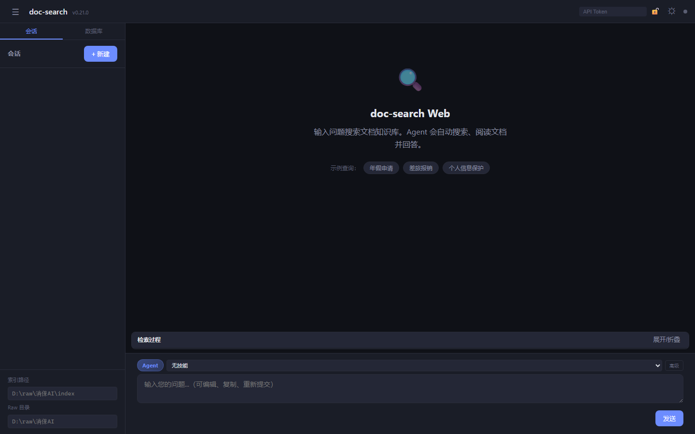
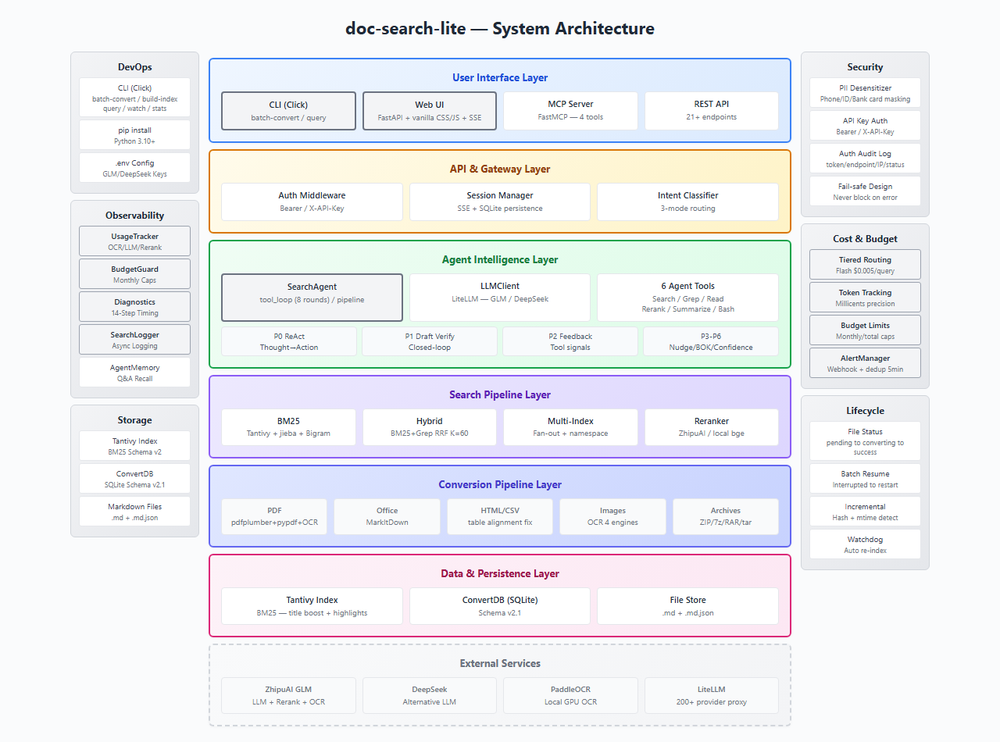
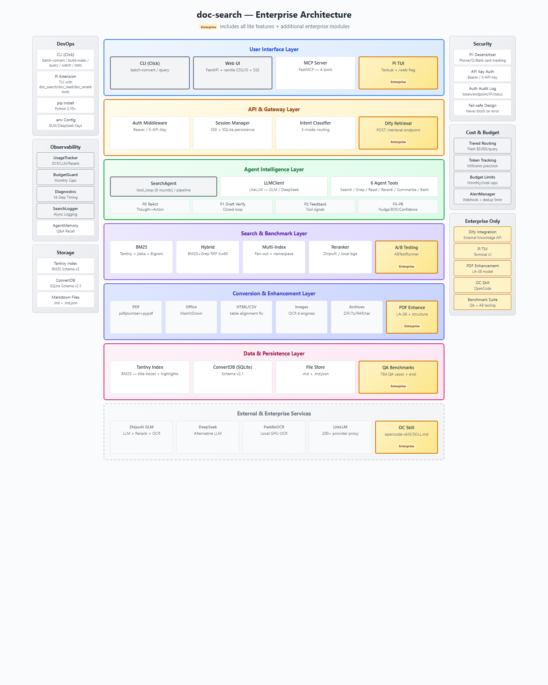

# doc-search-lite

<p align="right"><a href="README.md">English</a></p>

<p align="center">
  <strong>Your personal document deep-research assistant.</strong>
</p>

<div align="center">
  🔍 PDF/DOCX/XLSX/PPTX → Markdown → BM25 索引 → LLM 智能搜索 &nbsp;|&nbsp; 🚫 无向量数据库 &nbsp;|&nbsp; 🖥️ CLI + Web + API + MCP
</div>

<br>

[](LICENSE)
[](pyproject.toml)
[](https://github.com/rickqi/doc-search-lite/actions/workflows/ci.yml)

---

## 💥 简介

**doc-search** 始于一个个人工具，解决一个简单的问题：
成百上千份保险产品条款和医疗诊断手册
散落在各个文件夹中——仅靠关键词无法搜索。

在两个月内迭代 50+ 个版本（v0.1 → v0.21，2026年5月–7月），它成长为一个全功能的
**本地文档智能系统**，可将任何业务文档
转换为 Markdown，构建 Tantivy BM25 索引，让 LLM Agent
在你的知识库中搜索、阅读、交叉引用并回答问题。
文档从不离开你的机器。无需向量数据库。

**doc-search-lite** is the open-source MIT core of that personal tool,
stripped of enterprise-specific features and internal configuration.
如果你有一个装满 PDF、DOCX 或电子表格的文件夹，需要
提问诸如 *"年假怎么申请？"* 或 *"数据保护条款有哪些？"* 之类的问题——这就是为你准备的。

## 为什么选择 doc-search-lite？

这是 [doc-search](https://github.com/rickqi/doc-search) 的开源核心版本，
去除了企业功能和内部数据。**无向量数据库，无本地模型推理。**

| 功能 | doc-search（企业版） | doc-search-lite（开源版） |
|---------|:----------------------:|:---------------------:|
| BM25 + Agent RAG search | ✅ | ✅ |
| Multi-format document conversion | ✅ | ✅ |
| Web UI + API + MCP | ✅ | ✅ |
| PII desensitization | ✅ | ✅ |
| Hybrid search (BM25+Grep RRF) | ✅ | ✅ |
| Multi-index search | ✅ | ✅ |
| Document structure awareness | ✅ | ✅ |
| CLI stats / diagnostics / budget | ✅ | ✅ |
| PDF enhancement (LA-3B) | ✅ | ❌ |
| Dify external knowledge API | ✅ | ❌ |
| Pi TUI | ✅ (deprecated) | ❌ |
| QA benchmark scripts | ✅ | ❌ |
| OpenCode Skill | ✅ | ❌ |
| License | PolyForm Strict | **MIT** |

### 与 DCI-Agent-Lite 对比

[DCI-Agent-Lite](https://github.com/DCI-Agent/DCI-Agent-Lite) 是一个学术
研究框架，基于 **直接语料交互** 范式——
Agent 使用终端工具（`rg`、`find`、`sed`）直接搜索原始文本语料，
无需索引。两个项目共享 **无向量数据库** 的理念，
但针对不同的使用场景：

| Dimension | doc-search-lite | DCI-Agent-Lite |
|-----------|----------------|----------------|
| **Purpose** | Production document search system | Academic benchmark/evaluation |
| **Corpus** | Your own PDF/DOCX/XLSX/PPTX/HTML | Pre-formatted JSONL datasets (Wikipedia, BrowseComp) |
| **Indexing** | Tantivy BM25 (Rust) + jieba Bigram | **Zero index** — raw `rg`/`find` on text files |
| **Search modes** | BM25 / Grep / Hybrid (RRF) / Tag / Agent | Agent-only (bash tool loop) |
| **Document support** | 11 formats + OCR for images | Plain text / JSONL only |
| **Agent framework** | Custom SearchAgent (COMPILOT P0-P6) | Pi coding agent (bash + context mgmt) |
| **Interface** | CLI + Web UI + REST API + MCP 4 tools | Pi TUI only (`--terminal`) |
| **APIs** | FastAPI (21 routes), FastMCP (4 tools), SSE | None |
| **Observability** | Usage tracking, budget guard, 14-step diagnostics, search logging | None |
| **Security** | PII desensitization, API key auth | None |
| **Target audience** | Teams deploying document search | Researchers benchmarking agentic search |
| **License** | MIT | Apache 2.0 |
| **Paper** | — | [arXiv:2605.05242](https://arxiv.org/abs/2605.05242) |

## 快速开始

```bash
# 1. 安装
git clone https://github.com/rickqi/doc-search-lite.git
cd doc-search-lite
python -m venv .venv
.venv\Scripts\pip install -e ".[dev]"

# 2. 复制环境配置
copy .env.example .env
# 编辑 .env，设置 GLM_API_KEY=your-key

# 3. 转换文档
.venv\Scripts\python -m src.cli batch-convert ./docs --raw-root ./raw

# 4. 构建搜索索引
.venv\Scripts\python -m src.cli build-index ./raw

# 5. 搜索
.venv\Scripts\python -m src.cli query "search query" -i ./raw/index --agent

# 6. 启动 Web 界面
.venv\Scripts\python -m src.api
```

> 需要 **Python 3.10+** 和 **ZhipuAI GLM API 密钥**（也用于 Rerank 和 OCR）。
> DeepSeek 可作为备选 LLM 提供商。

## 演示

<p align="center">
  
  <br>
  <em>Web 界面（中文）— 欢迎页与快捷操作。<a href="docs/screenshots/web-ui-en.png">英文版 →</a> | <a href="docs/screenshots/web-ui-session.png">会话视图 →</a> | <a href="docs/screenshots/web-ui-dark.png">暗色主题 →</a></em>
</p>

## 功能特性

- **多格式转换**：PDF、DOCX、XLSX、PPTX、HTML、CSV、TXT、图片（OCR）、Outlook MSG、ZIP/7z/RAR 压缩包
- **BM25 全文搜索**：Tantivy（Rust）+ jieba 中文分词 + Bigram 回退
- **混合搜索**：BM25 + Grep 并行，RRF 融合排序，可配置策略（法律/技术/FAQ/通用）
- **多索引搜索**：跨文档库搜索，元数据路由精准定位
- **智能 Agent**：LLM 自主调用工具（搜索/读取/重排序），动态置信度控制迭代
- **COMPILOT 优化**（v0.14+）：ReAct 推理、Draft 验证闭环、工具反馈信号、收敛推促、Best-of-K、置信度校准
- **MCP 快速管线**（v0.15+）：查询改写 + 多查询 BM25 + 投机预读，~12-18s vs 全 tool_loop 40-90s
- **MCP 服务器**：FastMCP 4 工具（`doc_search`/`doc_agent`/`doc_read`/`doc_analyze`），自动索引发现
- **双 LLM 提供商**：ZhipuAI GLM / DeepSeek，一键切换
- **分层模型路由**：中间步骤用快速模型，最终答案用高精度模型
- **Web 界面**：SSE 流式推送、会话管理、DB 面板（Token 用量图表）、文件上传
- **PII 脱敏**：手机号/身份证/银行卡在 LLM 调用前自动脱敏并恢复
- **目录监控**：Watchdog 自动检测文件变更，增量更新索引
- **搜索模式**：BM25 / Grep / Hybrid / Tag / Agent — CLI + API + MCP 全覆盖
- **技能系统**：6 种内置分析技能 + 外部 SKILL.md 加载
- **统计与预算**：用量追踪（毫分精度）、预算守卫、搜索日志、14 步诊断
- **5 级复杂度**：simple（2轮）/ light（4轮）/ medium（8轮）/ complex（8轮 + 分解 + 验证 + BOK）

## 架构

<table style="width:100%;border-collapse:collapse">
<tr>
<td style="width:50%;vertical-align:top;padding:8px">
  <p align="center">
    
    <br>
    <em><strong>doc-search-lite</strong> — 开源 MIT 版</em>
  </p>
</td>
<td style="width:50%;vertical-align:top;padding:8px">
  <p align="center">
    
    <br>
    <em><strong>doc-search</strong> — 企业版（PolyForm Strict）</em>
  </p>
</td>
</tr>
</table>


### 管线流程

```
文档（PDF/DOCX/XLSX/PPTX/HTML/CSV/TXT/图片）
    │
    ConverterCoordinator → Markdown → .md + .md.json (headings, tags)
    │
    Tantivy Index (jieba + Bigram + title boost)
    │
    ┌── BM25 keyword search ────┐
    ├── Grep regex search        ├── 4 modes
    ├── Hybrid RRF fusion        │
    └── Tag-based recall ────────┘
    │
    ┌── Agent tool_loop (8 rounds) ──┐
    │  search → read → search →     │  COMPILOT P0-P6
    │  read → rerank → synthesize   │
    └────────────────────────────────┘
    │
    LLM（GLM / DeepSeek）→ 带引用的回答
```

### 本地数据库 (convert.db)

Each raw directory gets a `convert.db` (SQLite, WAL mode) that tracks every file's lifecycle end-to-end:

```
convert.db (per raw/ directory)
├── Schema: "2.1" (auto-migrated from 1.1 → 2.0 → 2.1)
├── WAL mode, foreign keys enabled
│
├── directories/     # Directory tree mirroring source structure
├── files/           # Per-file state machine
│   ├── status: pending → converting → success | failed | skipped
│   ├── source_hash, mtime for incremental detection
│   ├── converter, convert_time, ocr_tokens, pipeline_version
│   └── metadata_json, last_error
├── batches/         # Conversion batch history (resume support)
├── skipped/         # Skip reasons (unsupported format, password-protected)
├── config/          # Schema version, pipeline metadata
│
├── token_usage/     # OCR/LLM token consumption (per-file, per-model)
├── pricing/         # Model price mapping (millicents per token)
├── budget/          # Monthly/total budget limits and spending
│
├── search_feedback/ # 👍/👎 user relevance feedback
├── auth_log/        # API authentication audit trail
│
├── query_diagnostics/  # 14-step query performance timing
└── llm_call_log/       # Per-call LLM latency, tokens, retry count
```

## 命令

### 文档转换

```bash
python -m src.cli batch-convert ./docs --raw-root ./raw
python -m src.cli batch-convert ./docs --raw-root ./raw --mode incremental
python -m src.cli batch-convert ./docs --raw-root ./raw --parallel 4
python -m src.cli batch-convert ./docs --raw-root ./raw --force
python -m src.cli batch-convert ./docs --raw-root ./raw --no-ocr
```

### 索引管理

```bash
python -m src.cli build-index ./raw
python -m src.cli watch ./raw --debounce 1.0
python -m src.cli build-index ./raw --chunk-mode
```

### 搜索

```bash
python -m src.cli query "annual leave policy" -i ./raw/index -l 5
python -m src.cli query "confidentiality" -i ./raw
python -m src.cli query "data protection" -i ./raw/index --search-mode hybrid
python -m src.cli query "报销" -i ./raw/index --search-mode tag
python -m src.cli query "keyword" -i ./raw/index --export json -o results.json
```

### Agent 智能搜索

```bash
python -m src.cli query "How do I apply for annual leave?" -i ./raw/index --agent
python -m src.cli query "What's the travel reimbursement policy?" -i ./raw/index --agent --rerank
python -m src.cli query "出差标准" -i ./raw/index --agent --skill summarize
python -m src.cli query "" -i ./raw/index --interactive
```

### Web 界面

```bash
python -m src.api
python -m src.api --host 0.0.0.0 --port 8080
```

### MCP 服务器

```bash
pip install -e ".[mcp]"
python -m src.mcp_server
```

**MCP Tools**:

| Tool | Description |
|------|-------------|
| `doc_search` | BM25 / Hybrid / Grep keyword search |
| `doc_agent` | Agentic RAG with LLM answer generation |
| `doc_read` | Read full document content by doc_id or source_path |
| `doc_analyze` | Deep document analysis (compare/extract/summarize/table) |

### 统计与诊断

```bash
python -m src.cli stats summary --days 7
python -m src.cli stats daily --days 30
python -m src.cli stats export --format html -o report.html
python -m src.cli stats budget list
python -m src.cli stats diagnostics --days 7
python -m src.cli stats slow-queries --threshold 30000
```

### 目录迁移

```bash
python -m src.cli diff-migrate /path/to/base /path/to/compare
python -m src.cli diff-migrate /path/to/base /path/to/compare --export-new /path/to/export
```

## 支持的格式

| Format | Extension | Converter |
|--------|-----------|-----------|
| PDF | `.pdf` | pdfplumber + pypdf (scanned PDF auto OCR) |
| Word | `.docx` | MarkItDown |
| Excel | `.xlsx`, `.xls` | MarkItDown (>5MB auto LibreOffice → CSV) |
| PowerPoint | `.pptx` | MarkItDown |
| HTML | `.html`, `.htm` | MarkItDown + table alignment fix |
| CSV | `.csv` | pandas + auto encoding detection |
| Text | `.txt` | Auto encoding (utf-8/gbk/gb2312) |
| Markdown | `.md` | Pass-through |
| Images | `.png`, `.jpg`, `.jpeg`, `.bmp`, `.webp` | ZhipuAI / PaddleOCR / PP-StructureV3 |
| Email | `.msg` | olefile (Outlook OLE2) |
| Archives | `.zip`, `.7z`, `.rar`, `.tar`, `.gz` | Extract → convert → clean |

> `.doc` format requires pre-conversion to `.docx` via LibreOffice.

## 配置

Copy `.env.example` to `.env` and configure:

```ini
GLM_API_KEY=your-glm-api-key
GLM_BASE_URL=https://open.bigmodel.cn/api/paas/v4
LLM_PROVIDER=glm
LLM_MODEL=glm-4
DEEPSEEK_API_KEY=your-deepseek-api-key
LLM_TIERED_ROUTING=false
WEB_API_KEY=your-secret-key
OCR_ENGINE=zhipu
```

## 项目结构

```
src/
├── cli.py              # Click CLI 入口（batch-convert / build-index / query / watch / stats）
├── api.py              # FastAPI 服务器（21+ 路由、SSE 流式、文件上传）
├── mcp_server.py       # FastMCP 服务器（4 个工具、自动索引发现）
├── agent/              # SearchAgent + 7 个工具 + LLMClient
│   ├── search_agent.py     # Agent 循环（COMPILOT P0-P6，8 轮）
│   ├── llm_client.py       # LiteLLM 封装 + 分层路由
│   ├── analysis_agent.py   # 文档分析
│   └── tools/              # search / grep / read / rerank / summarize / bash / analyze
├── converter/          # 文档→Markdown 管线
│   ├── coordinator.py      # 自动路由 + OCR 回退
│   ├── pdf.py / office.py / html.py / csv.py / text.py / image.py / msg.py / archive.py
│   └── ocr.py              # 4 种 OCR 引擎
├── search/             # 搜索管线
│   ├── bm25_search.py      # BM25（jieba + Bigram + 标题加权）
│   ├── hybrid.py           # BM25+Grep RRF 融合
│   ├── multi_index.py      # 多索引搜索
│   ├── query_router.py     # 关键词路由（零 LLM 开销）
│   └── reranker.py         # ZhipuAI 云端 Rerank
├── storage/            # 持久化层
│   ├── index.py            # Tantivy BM25 索引（Schema v2）
│   ├── convert_db.py       # SQLite（Schema v2.1）
│   └── markdown_store.py   # Markdown 存储
├── web/                # Web 界面（零构建 vanilla HTML/CSS/JS）
│   ├── auth.py             # API Key 认证
│   ├── session_manager.py  # 会话 CRUD
│   ├── sse_events.py       # 11 种 SSE 事件类型
│   ├── intent_classifier.py # 查询意图路由
│   ├── upload_manager.py   # 文件上传管线
│   └── static/             # HTML / CSS / JS / i18n
├── stats/              # 用量 + 诊断 + 预算
│   ├── usage_tracker.py    # OCR/LLM/Rerank 追踪
│   ├── budget_guard.py     # 预算执行
│   ├── search_logger.py    # 搜索日志
│   └── diagnostics.py      # 14 步计时
├── security/           # PII 脱敏
│   ├── desensitizer.py     # 统一入口
│   └── maskers.py          # PII/关键词/正则脱敏器
├── watch/              # 目录监控
│   └── index_watcher.py    # Watchdog → 增量索引
└── utils/              # 配置 / 哈希 / 工具
    ├── config.py           # 多提供商 LLM 配置
    ├── hash.py             # 文件/内容哈希
    └── dir_diff.py         # 目录对比
```
## 环境变量

| 变量 | 必需 | 默认值 | 说明 |
|----------|----------|---------|-------------|
| GLM_API_KEY | ✅ | — | ZhipuAI GLM API 密钥（也用于 Rerank 和 OCR） |
| GLM_BASE_URL | ✅ | https://open.bigmodel.cn/api/paas/v4 | GLM API 端点 |
| DEEPSEEK_API_KEY | ❌ | — | DeepSeek API 密钥 |
| LLM_PROVIDER | ❌ | glm | glm 或 deepseek |
| LLM_MODEL | ❌ | glm-4 | 默认模型名称 |
| LLM_TIERED_ROUTING | ❌ | alse | 启用快速/高精度分层路由 |
| LLM_FAST_MODEL | ❌ | deepseek-v4-flash | 中间步骤快速模型 |
| LLM_POWER_MODEL | ❌ | deepseek-v4-pro | 最终答案高精度模型 |
| WEB_API_KEY | ❌ | — | API 认证 Bearer Token |
| DESENSITIZE_ENABLED | ❌ | 	rue | LLM 调用时 PII 脱敏 |
| OCR_ENGINE | ❌ | zhipu | OCR 引擎选择 |
| SEARCH_DEFAULT_LIMIT | ❌ | 10 | 默认结果数量 |
| LOG_LEVEL | ❌ | INFO | 日志级别 |
| MAX_WORKERS | ❌ | 4 | 线程池大小 |

## 技术栈

| Layer | Technology |
|-------|-----------|
| Search engine | Tantivy (Rust, Python bindings) |
| Chinese tokenization | jieba + Bigram fallback |
| LLM integration | LiteLLM (GLM / DeepSeek / 200+ providers) |
| Rerank | ZhipuAI cloud API (default) or local bge-reranker-v2-m3 |
| OCR | ZhipuAI / PaddleOCR / PaddleOCR HTTP / PP-StructureV3 |
| Document conversion | MarkItDown 0.1.x, pdfplumber, pypdf, olefile, pandas |
| Web framework | FastAPI + SSE + vanilla CSS/JS + Chart.js |
| CLI framework | Click + Rich |
| Storage | SQLite (WAL mode), Tantivy index, filesystem |
| File watching | watchdog |

## 关键设计决策

- **无向量数据库**：BM25 + jieba 对保险/法律/监管文档提供更好的关键词精确匹配
- **整篇文档索引**：保留完整上下文，避免分块丢失文档结构
- **基于结果错误处理**：全栈使用 `ConvertResult(success, errors)` 和 `ToolResult.ok()/.fail()`
- **可选追踪**：`UsageTracker=None` 在任何地方都合法——未配置时零开销
- **安全脱敏**：PII 脱敏失败回退到原文，绝不阻断 LLM 调用
- **分层路由**：中间步骤用便宜模型，最终答案才用昂贵模型

## 开发

```bash
.venv\Scripts\python.exe -m pytest tests/ -q --tb=short
.venv\Scripts\python.exe -m pytest tests/ --cov
.venv\Scripts\ruff check src/ tests/
.venv\Scripts\ruff format src/ tests/
```

## 许可协议

MIT 协议 — 详见 [LICENSE](LICENSE)。
